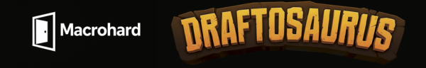

  

🦖 S.I.G.P.D.

Sistema Informático de Gestión de Partidas para Draftosaurus
Desarrollado por MacroHard

🧩 ¿Qué es?

S.I.G.P.D. es una aplicación web diseñada para gestionar partidas del juego de mesa Draftosaurus. Permite iniciar, jugar y controlar partidas de manera digital, rápida y sencilla.

⚙️ Instalación

No requiere conocimientos avanzados. Solo seguí estos pasos:

1️⃣ Descargar el proyecto

Tenés dos opciones:

Opción A: Usando Git (para usuarios que lo tengan instalado)

git clone https://github.com/Macrohard2025/MacroHard.git

Luego, entrá a la carpeta del proyecto:

cd MacroHard

Opción B: Descargando ZIP desde GitHub

Hacé clic en el botón verde Code del repositorio.

Seleccioná Download ZIP.

Extraé el archivo ZIP en tu computadora.

2️⃣ Instalar XAMPP

Descargá XAMPP desde su página oficial: https://www.apachefriends.org/es/index.html

Instalalo con las opciones predeterminadas.

Una vez instalado, abrí XAMPP y iniciá los módulos:

Apache (servidor web)

MySQL (base de datos)

3️⃣ Copiar el proyecto a XAMPP

Copiá la carpeta del proyecto dentro de la carpeta htdocs de XAMPP. Por ejemplo:

C:\xampp\htdocs\MacroHard

4️⃣ Iniciar la aplicación

Abrí http://localhost/MacroHard
 en tu navegador.

La primera vez que ingreses, si el usuario admin y la base de datos no están creadas, el sistema te llevará a un formulario para registrar al administrador y posteriormente creará la base de datos.

¡Listo! Ya podés empezar a jugar y gestionar partidas.

💼 Sobre MacroHard

MacroHard es un equipo de desarrollo formado por Mateo Más, Florencia del Castillo, Luna Vera y Santiago Alvez. Apostamos a proyectos educativos con impacto real, combinando creatividad, programación y diseño de juegos.

🧠 Tecnologías utilizadas

HTML5

CSS3

JavaScript

Bootstrap

PHP

MySQL
